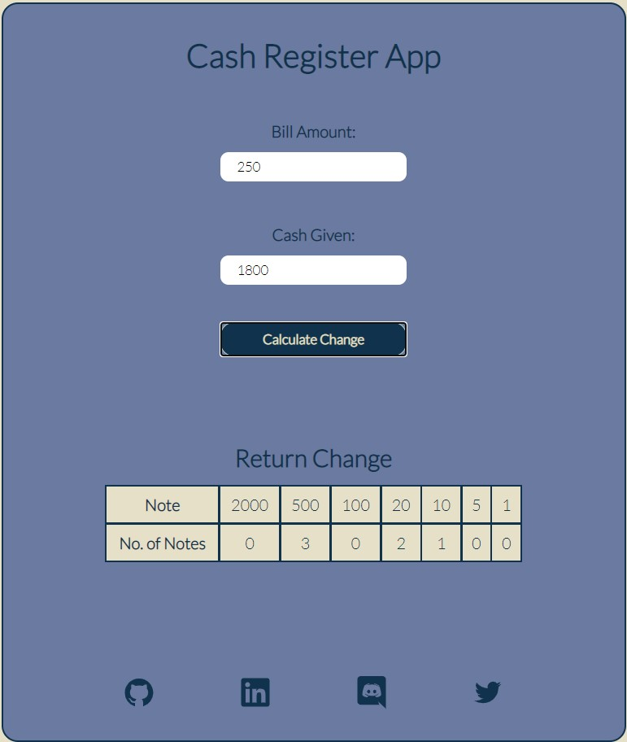

# Cash Register

### Description

###### (levelZero_markTen)

The app calculates the number of notes of each denomination to be returned after the user inputs the total amount and cash given.



### My learnings

- object destructing
- conditional rendering

### Tech Stack

React, CSS

# Installation

```bash
git clone https://github.com/anshulraheja/levelZero_markTen.git
npm install
```

CodeSandBox [Link](https://codesandbox.io/s/github/anshulraheja/levelZero_markTen)
